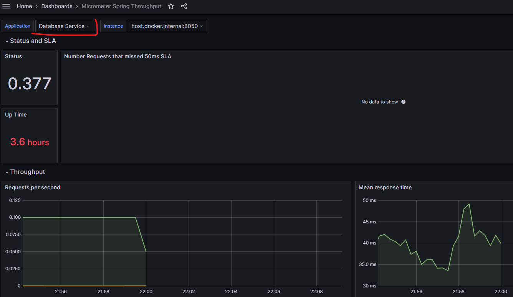

##Как посмотреть что то в Grafana

Чтобы все метрики увидеть в графане нужно запустить docker-compose
Это можно сделать командой в теримнале

## Просмотр метрик о серивсах в Grafana

**Чтобы все метрики увидеть в графане нужно запустить docker-compose\n
Это можно сделать командой в теримнале, но нужно находиться в директории с файлом docker-compose.yml**

    docker compose up -d

Чтобы посмотреть все доступные для мониторинга эндпоинты в прометейсе можно пройти по ссылке

    http://localhost:9090/targets

Для входа графану нужно пройти по адресу (логин/пароль в docker-compose)
    
    http://localhost:3000

После входа зайти в Dashboards и можно наблюдать данные которые смог собрать прометеус. Выбирать можно каждый сервис
